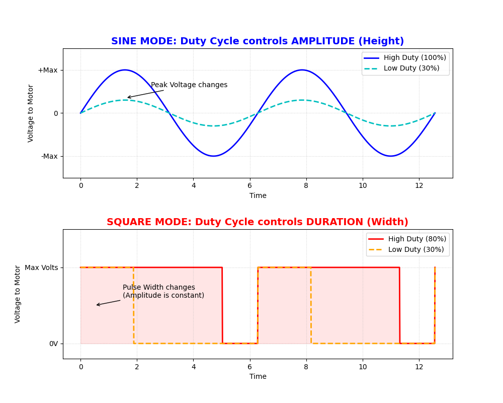

# Haptic Waveform Control Strategy: SINE vs. SQUARE

## Overview
This document details the technical implementation of the vibration control logic within the `main_linear.c` firmware. It explains how the **Duty Cycle (0-31)** parameter physically modulates the actuator output differently depending on the selected waveform mode (SINE or SQUARE).

## Visual Comparison
The following graph illustrates the fundamental difference between the two modes:



---

## 1. SQUARE Mode: Time-Domain Modulation
In this mode, the Duty Cycle controls the **duration (width)** of the actuation pulse.

* **Mechanism:** Time-based Windowing.
* **Logic:** The H-Bridge operates in a binary state.
    * **ON:** Full Voltage (Max Power).
    * **OFF:** 0V (Coast).
* **Implementation:** The code compares a counter against the `duty_pct`.
    ```c
    if (counter < duty_pct) { OUTPUT = MAX; } 
    else                    { OUTPUT = 0;   }
    ```
* **Physical Result:** Increasing the Duty Cycle widens the energy block (ON-time) without changing the instantaneous voltage level.
* **Haptic Characteristic:** Sharp, aggressive "kick". Ideal for alerts and strong feedback.

---

## 2. SINE Mode: Amplitude Modulation (SPWM)
In this mode, the Duty Cycle controls the **peak amplitude (height)** of the wave.

### Technical Construction (Direct Digital Synthesis)
The sine wave is not generated by an analog oscillator but synthesized digitally using a **Look-Up Table (LUT)** and **Sinusoidal Pulse Width Modulation (SPWM)**.

1.  **Look-Up Table (LUT):**
    The firmware stores a pre-calculated table of 64 signed 8-bit samples representing one full period ($2\pi$) of a sine wave:
    $$y[i] = 127 \cdot \sin\left(\frac{2\pi \cdot i}{64}\right)$$
    *Where $i$ is the index from 0 to 63.*

2.  **Frequency Generation (Timer 1):**
    Timer 1 triggers an interrupt at fixed intervals. At each interrupt, the firmware advances the LUT index ($i \rightarrow i+1$), determining the fundamental frequency of the vibration.

3.  **Amplitude Scaling (Timer 2 PWM):**
    The **Duty Cycle (0-31)** input acts as a digital gain coefficient ($A$). For every sample read from the LUT, the PWM duty cycle is calculated as:
    $$PWM_{output}(t) = \frac{|y[i]| \times A}{128}$$
    *Where $A$ is the scaled amplitude requested by the user.*

4.  **Physical Reconstruction (H-Bridge):**
    The H-Bridge polarity is switched based on the sign of $y[i]$ to reconstruct the AC signal from the DC supply (Zero-crossing).

### Functional Summary
* **Logic:** The H-Bridge switches at high frequency (~40kHz) to create an average analog voltage proportional to the sine table.
* **Haptic Characteristic:** Smooth, precise texture. Ideal for UI navigation and subtle effects.

---

## Summary Table

| Feature | **SQUARE Mode** | **SINE Mode** |
| :--- | :--- | :--- |
| **Control Domain** | **Time** (Pulse Width) | **Amplitude** (Signal Height) |
| **Voltage State** | Binary (0V or Max) | Analog-like (Progressive) |
| **Energy Profile** | High (100% Fill during ON state) | Moderate (Rounded shape) |
| **Primary Use Case** | Impact / Notification | Texture / Immersion |

---

## Conclusion
By implementing these two distinct modulation strategies, the system provides a versatile haptic range:
1.  **SINE** allows for high-fidelity, "premium" feel control.
2.  **SQUARE** maximizes the physical energy transfer for maximum alert perceptibility.
