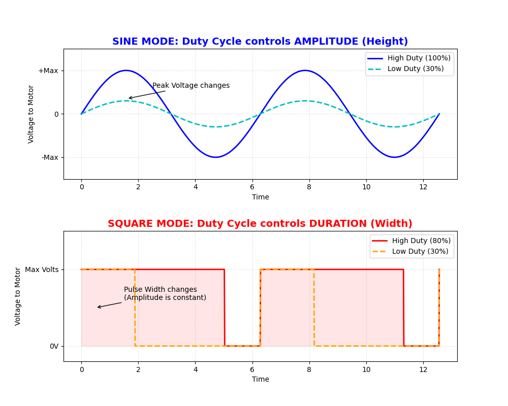

# Sine and square waveform control

The PIC16F18313 firmware supports two vibration modes. Both accept an intensity
value from `0` to `31`, but they apply it differently.

## Square mode

Square mode controls the on-time of a full-power alternating signal. Increasing
the requested intensity widens each active portion of the waveform.

- Control domain: pulse width.
- Output: full voltage or off.
- Character: sharp and energetic.
- Typical use: impacts, alerts, and strong feedback.

The firmware uses a calibrated 32-entry lookup table so the perceived increase
is gradual at low levels and reaches full power at level `31`.

## Sine mode

Sine mode synthesizes a 64-sample waveform using a lookup table and sinusoidal
PWM. The requested intensity scales the peak amplitude.

- Control domain: amplitude.
- Output: PWM-reconstructed sine waveform.
- Character: smooth and precise.
- Typical use: textures and subtle feedback.

The H-bridge polarity changes at each zero crossing, while a high-frequency PWM
signal controls the magnitude of each sample.

## Summary

| Feature | Square | Sine |
| --- | --- | --- |
| Controlled quantity | Pulse width | Peak amplitude |
| Instantaneous output | Full power or off | Progressive PWM level |
| Perceived character | Sharp | Smooth |
| Intensity range | `0–31` | `0–31` |
